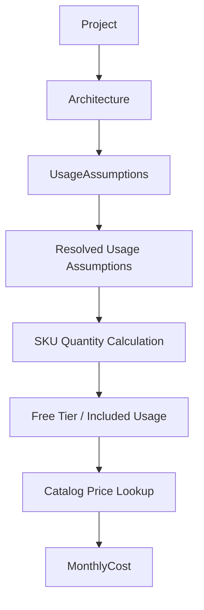

# AWS Pricing Engine (Mirror Azure Architecture)

## Current State

Azure has a complete end-to-end pipeline; AWS has catalog ingestion only.

| Layer | Azure | AWS today |
|---|---|---|
| Usage inference registry | [`AzurePricingModelRegistry`](backend/app/pricing/usage/registry/azure.py) | Missing |
| Pricing models | [`definitions.py`](backend/app/pricing/azure/definitions.py) (6 services) | Missing |
| SKU quantity calculators | [`sku_quantities/`](backend/app/pricing/azure/sku_quantities/) | Missing |
| Free tier / allowances | [`free_tier.py`](backend/app/pricing/azure/free_tier.py) | Missing |
| Catalog lookup | [`catalog_lookup.py`](backend/app/pricing/azure/catalog_lookup.py) → `azure_catalog` | Missing (ingestion exists: [`AwsCatalogRepository`](backend/app/pricing_ingestion/repositories/aws_catalog_repository.py)) |
| Cost orchestration | [`project_costing.py`](backend/app/pricing/azure/project_costing.py) | Missing |
| Runtime routing | [`ProjectPricingService`](backend/app/services/project_pricing_service.py) → Azure pipeline | AWS → [`HeuristicProviderPricing`](backend/app/pricing/providers/heuristic.py) stub |

**MVP service scope** (mirrors Azure’s 6 core workload services mapped in [`component_catalog_seed.py`](backend/app/data/component_catalog_seed.py)):

| Component type | AWS service | Azure equivalent |
|---|---|---|
| service / worker | Lambda | Azure Functions |
| service / worker | ECS Fargate | Azure Container Apps |
| database | RDS | Azure SQL Database |
| object_storage | S3 | Blob Storage |
| queue | SQS | Queue Storage / Service Bus |

DynamoDB, API Gateway, CloudFront, etc. are deferred to a follow-up once the core pipeline is proven.

---

## Target Pipeline (unchanged flow)



Both providers share stages 1–2 via [`UsageAssumptionsService`](backend/app/pricing/usage/service.py). Stages 3–7 are provider-specific modules that follow the same class/file layout as Azure.

---

## Architecture: Parallel Provider Modules + Thin Shared Generalization

**Do not rewrite Azure.** Add a sibling `pricing/aws/` package and make the smallest shared changes needed for multi-provider inference.

```
pricing/
├── usage/          # extend registries, behavioral models, scalers (provider-aware)
├── azure/          # unchanged structure
├── aws/            # NEW — mirror azure/ layout
│   ├── definitions.py
│   ├── registry.py
│   ├── usage_model_builder.py
│   ├── usage_inference.py
│   ├── project_pricing.py
│   ├── project_costing.py
│   ├── free_tier.py
│   ├── allowances.py
│   ├── sku_roles.py
│   ├── meter_scaling.py
│   ├── catalog_lookup.py
│   ├── cost_calculator.py
│   └── sku_quantities/
│       ├── calculator.py
│       ├── lambda.py
│       ├── ecs_fargate.py
│       ├── rds.py
│       ├── s3.py
│       └── sqs.py
```

---

## Step 1 — Minimal Shared Schema & Protocol Generalization

**Files:** [`schemas.py`](backend/app/pricing/schemas.py), [`protocols.py`](backend/app/pricing/usage/protocols.py)

- Add `AwsServicePricingModel` (mirror `AzureServicePricingModel` with `cloud: Literal["aws"]`).
- Add `ProjectAwsCostResult` (mirror `ProjectAzureCostResult`).
- Generalize `ComponentPricingInput`:
  - Add `provider: CloudProvider`
  - Add `cloud_service: str` (canonical service name)
  - Keep `azure_service` as a backward-compatible alias via Pydantic validator/field default so existing Azure code and tests keep working during migration
- Update `PricingModelRegistry.resolve_model()` return type to `AzureServicePricingModel | AwsServicePricingModel | None`.
- Update `CalculatedSkuDefinition.catalog_sku_roles` docstring to reference `aws_catalog` as well (no behavioral change).

**Azure touch surface:** only rename `component.azure_service` → `component.cloud_service` in a few orchestration files ([`project_pricing.py`](backend/app/pricing/azure/project_pricing.py), [`project_costing.py`](backend/app/pricing/azure/project_costing.py)) — or read through a shared property to avoid wide diffs.

---

## Step 2 — AWS Pricing Model Definitions

**New file:** `backend/app/pricing/aws/definitions.py`

Define 5 pricing models (Lambda, ECS Fargate, RDS, S3, SQS) using the same declarative pattern as Azure:

- `required_inputs` — billing inputs (e.g. Lambda: `executions_per_month`, `avg_execution_duration_ms`, `memory_mb`, `network_egress_gb`)
- `calculated_skus` — maps to calculator `sku_key`s and catalog roles
- `free_tier` — AWS Free Tier allowances (e.g. Lambda: 1M requests + 400K GB-seconds/month for 12 months — model as always-on monthly allowance for v1, same pattern as Azure subscription pools)
- `catalog_service_name` — matches Firestore doc name from ingestion (e.g. `"Lambda"`, `"S3"`, `"RDS"`)

**New file:** `backend/app/pricing/aws/registry.py` — copy the indexing pattern from [`azure/registry.py`](backend/app/pricing/azure/registry.py).

**Catalog role alignment:** Map calculator `sku_key` → roles produced by [`AwsCatalogNormalizer._infer_sku_role`](backend/app/pricing_ingestion/normalizers/aws_catalog_normalizer.py) (`requests`, `duration`, `storage`, `egress`, etc.). Validate against synced catalog docs before locking role names.

---

## Step 3 — Usage Inference Layer (Provider-Aware, Not Rewritten)

**Register AWS in context builder** — [`context_builder.py`](backend/app/pricing/usage/context_builder.py):

```python
_PROVIDERS = {
    "azure": AzurePricingModelRegistry(),
    "aws": AwsPricingModelRegistry(),  # new
}
```

**Behavioral models & scaling** — extend [`behavioral_models.py`](backend/app/pricing/usage/behavioral_models.py) and [`scaling.py`](backend/app/pricing/usage/scaling.py):

- Add AWS entries for the 5 services, reusing the same per-user behavioral keys where billing semantics align (e.g. `sessions_per_user_per_month` → Lambda `executions_per_month`, S3 read/write ops).
- Make `get_behavioral_model(service, provider="azure")` provider-aware (or split into `get_aws_behavioral_model` with a unified dispatcher).

**Heuristic fallback** — [`heuristic_provider.py`](backend/app/pricing/usage/inference/fallback/heuristic_provider.py):

- Inject provider-specific `UsageModelBuilder` and `PricingModelRegistry` based on `context.provider`.
- New [`aws/usage_model_builder.py`](backend/app/pricing/aws/usage_model_builder.py) — mirror [`azure/usage_model_builder.py`](backend/app/pricing/azure/usage_model_builder.py) topology/MAU derivation for AWS service names.

**LLM path** — [`prompt_builder.py`](backend/app/pricing/usage/inference/llm/prompt_builder.py) and [`response_validator.py`](backend/app/pricing/usage/inference/llm/response_validator.py):

- Replace hardcoded `get_azure_pricing_model` with registry lookup from `context.provider`.
- Emit `ComponentPricingInput(provider=..., cloud_service=...)` instead of `azure_service`.

**New registry adapter:** `backend/app/pricing/usage/registry/aws.py` (mirror [`azure.py`](backend/app/pricing/usage/registry/azure.py)).

**New facade:** `backend/app/pricing/aws/usage_inference.py` — thin wrapper over `UsageAssumptionsService(provider="aws")`, mirroring [`azure/usage_inference.py`](backend/app/pricing/azure/usage_inference.py).

---

## Step 4 — AWS SKU Quantity Calculators

**New package:** `backend/app/pricing/aws/sku_quantities/`

Mirror Azure calculator structure. Key formulas (aligned to AWS billing meters and catalog roles):

| Service | Calculator output SKU keys | Formula basis |
|---|---|---|
| **Lambda** | `requests`, `gb_seconds`, `egress` | Same math as [`functions.py`](backend/app/pricing/azure/sku_quantities/functions.py); map `duration` catalog role |
| **ECS Fargate** | `vcpu_hours`, `memory_gb_hours`, `egress` | Mirror Container Apps vCPU/memory-seconds → hours |
| **RDS** | `instance_hours`, `storage_gb_month`, `backup_storage_gb` | Mirror SQL Database; tier-included storage via allowances |
| **S3** | `storage_gb_month`, `requests` (GET/PUT), `egress` | Mirror Blob Storage pass-through + ops |
| **SQS** | `requests` | Mirror queue ops; Standard vs FIFO via config input |

Reuse shared helpers pattern from [`sku_quantities/_helpers.py`](backend/app/pricing/azure/sku_quantities/_helpers.py) (copy to `aws/sku_quantities/_helpers.py` — small duplication is acceptable to avoid rewriting Azure).

**Orchestration:** `backend/app/pricing/aws/project_pricing.py` — copy [`calculate_project_azure_sku_quantities`](backend/app/pricing/azure/project_pricing.py) with AWS registry + free-tier pool.

---

## Step 5 — AWS Free Tier, Catalog Glue, Cost Calculator

Mirror these Azure files with AWS-specific rules:

| Azure file | AWS counterpart | Notes |
|---|---|---|
| [`allowances.py`](backend/app/pricing/azure/allowances.py) | `aws/allowances.py` | Account-level pools: Lambda requests/GB-seconds, S3 storage, SQS requests |
| [`free_tier.py`](backend/app/pricing/azure/free_tier.py) | `aws/free_tier.py` | Same `FreeTierPoolState` pattern |
| [`sku_roles.py`](backend/app/pricing/azure/sku_roles.py) | `aws/sku_roles.py` | Map calculator keys → `aws_catalog` roles |
| [`meter_scaling.py`](backend/app/pricing/azure/meter_scaling.py) | `aws/meter_scaling.py` | AWS unit normalization (per 1M requests, per GB-month, etc.) |
| [`catalog_lookup.py`](backend/app/pricing/azure/catalog_lookup.py) | `aws/catalog_lookup.py` | Read from `AwsCatalogRepository`; same caching pattern |
| [`cost_calculator.py`](backend/app/pricing/azure/cost_calculator.py) | `aws/cost_calculator.py` | Quantity × unit price → `ProjectAwsCostResult` |

**End-to-end orchestrator:** `backend/app/pricing/aws/project_costing.py` — copy [`AzureProjectCostingPipeline`](backend/app/pricing/azure/project_costing.py) structure:

```python
inputs = pricing_inputs or aws_usage_inference.infer_components(...)
quantity_result = calculate_project_aws_sku_quantities(inputs)
return aws_cost_calculator.calculate_project(quantity_result, models_by_service)
```

---

## Step 6 — Wire Into Services

**[`ProjectPricingService`](backend/app/services/project_pricing_service.py):**

- Add `AwsProjectCostingPipeline` alongside Azure in `create_default()` (Firestore → `AwsCatalogRepository` → `AwsCatalogLookup` → `AwsCostCalculator`).
- In `estimate()`: route `provider == "aws"` to AWS pipeline (single point estimate, same as Azure); keep GCP on heuristic stub.
- Accept per-provider pricing inputs:

```python
pricing_inputs: list[ComponentPricingInput] | None = None       # azure (backward compat)
aws_pricing_inputs: list[ComponentPricingInput] | None = None  # new
```

**[`GenerationService`](backend/app/services/generation_service.py):**

- After Azure usage inference, run AWS inference via `UsageAssumptionsService.infer(..., provider="aws")` using the same LLM response path once prompt/validator are provider-aware (or heuristic-only for AWS on first pass if LLM prompt extension is deferred).
- Pass both input sets to `ProjectPricingService.estimate()`.
- Persist AWS `pricing_detail` with `inference_source` in `ProviderCost` (same shape as Azure).

**Frontend: not required.** The AWS pricing engine is backend-only. No frontend work is in scope for this plan.

What works without any frontend changes once the backend ships:

- `POST /generate-pricing` returns catalog-based AWS totals in `cost_estimates` (same API shape as Azure today)
- AWS `monthly_low` / `monthly_high` and `notes` display in the Cloud Costs summary list (already provider-agnostic)
- Full AWS `pricing_detail` (SKU line items, usage assumptions) is persisted in the DB and returned by the API

What the UI will *not* show until a separate, optional frontend PR:

- AWS usage assumptions panel and SKU breakdown (currently gated to Azure only in [`CloudCostsSection.jsx`](frontend/src/features/architecture/components/document/CloudCostsSection.jsx))
- Correct `source: "catalog"` label for AWS ([`deriveArchitecture.js`](frontend/src/features/architecture/utils/deriveArchitecture.js) hardcodes non-Azure as `"heuristic"`)

These are cosmetic/display gaps only — they do not block the pricing engine from functioning correctly.

---

## Step 7 — Tests

Mirror Azure test patterns (reuse fake Firestore fixtures from [`test_aws_pricing_sync.py`](backend/tests/test_aws_pricing_sync.py)):

| New test file | Covers |
|---|---|
| `test_aws_sku_quantities.py` | Per-service quantity formulas |
| `test_aws_catalog_cost.py` | End-to-end quantity × catalog price |
| `test_aws_free_tier.py` | Account-level pool deduction |
| `test_project_pricing_service.py` (extend) | AWS returns catalog estimate, not heuristic |
| `test_aws_usage_inference.py` | Registry + heuristic fallback for AWS components |

Add a fixture catalog doc builder (like Azure’s `azure_catalog_test_fixture.py`) with Lambda/S3/RDS sample SKUs matching normalizer roles.

**Deferred:** validation suite, benchmark scripts, human validation reports (mirror [`validation_suite.py`](backend/app/pricing/azure/validation_suite.py) in a later phase).

---

## Implementation Order

1. Schemas + protocols (small, unblocks everything)
2. AWS definitions + registry + usage registry adapter
3. Behavioral models + scalers + usage_model_builder
4. Provider-aware heuristic/LLM inference
5. SKU quantity calculators + free tier
6. Catalog lookup + cost calculator + project_costing
7. ProjectPricingService + GenerationService wiring
8. Tests

Each step is independently testable; steps 5–6 can proceed in parallel once definitions exist.

---

## Key Design Constraints

- **No Azure rewrites** — only additive shared changes and provider field generalization.
- **Reuse ingestion as-is** — `aws_catalog` Firestore docs and [`AwsCatalogNormalizer`](backend/app/pricing_ingestion/normalizers/aws_catalog_normalizer.py) role inference are the catalog source of truth.
- **Same data contracts** — downstream stages consume `ComponentPricingInput` → `SkuQuantityResult` → `ComponentCostResult`; AWS adds parallel result type but identical field shapes.
- **Heuristic stub stays for GCP** — only AWS graduates from [`HeuristicProviderPricing`](backend/app/pricing/providers/heuristic.py).
